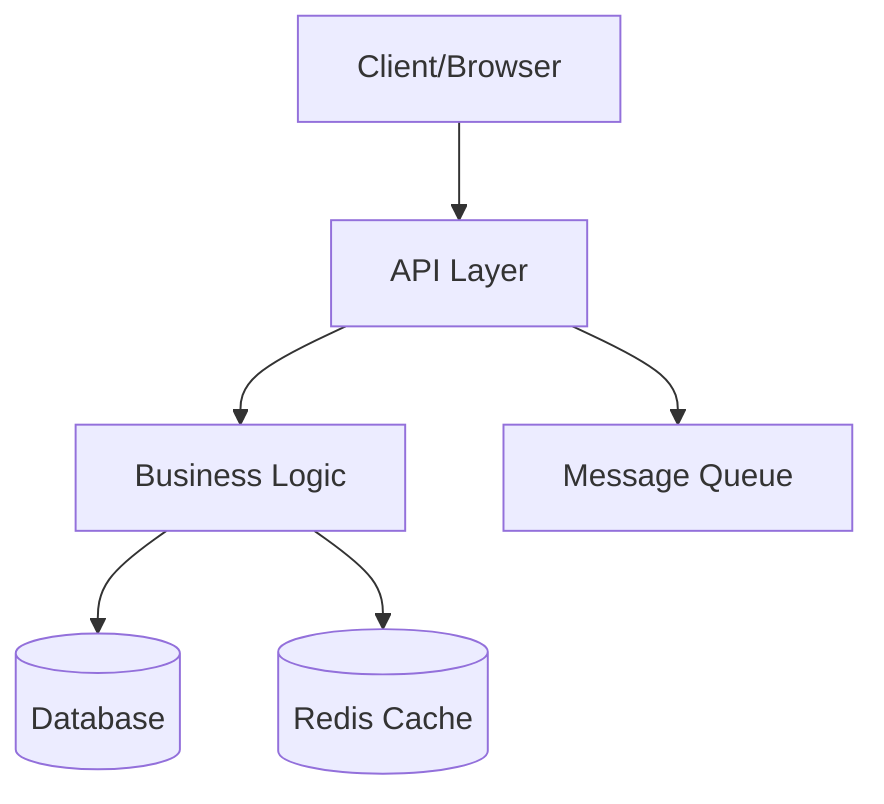
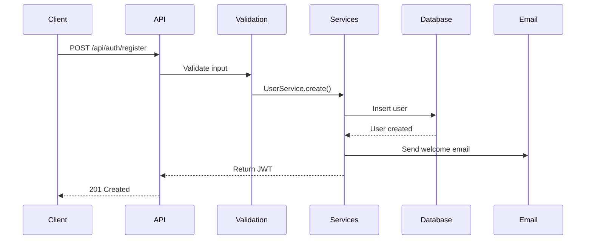
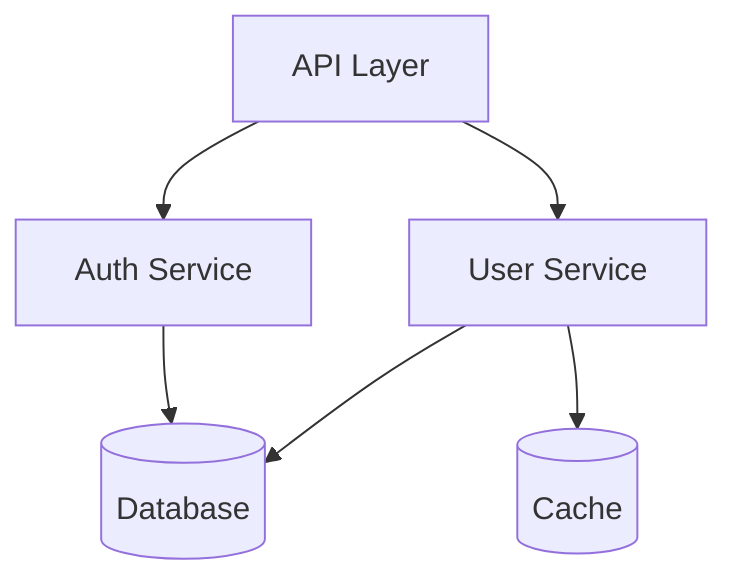

# Codebase Summarizer

Generate comprehensive architecture documentation from repository analysis.

## Core Workflow

1. **Scan structure**: Recursively analyze folder tree and file organization
2. **Identify patterns**: Detect framework, architecture style, key directories
3. **Map entry points**: Find main files, routes, APIs, CLI commands
4. **Trace data flow**: Follow requests through layers (controllers → services → models)
5. **Document modules**: Explain purpose and responsibilities of each directory
6. **Create navigation**: Build "how to" guides for common tasks
7. **Generate diagrams**: Add Mermaid diagrams for visual architecture

## Documentation Structure

### ARCHITECTURE.md Template

````markdown
# Architecture Overview

## System Summary

[Project Name] is a [type] application built with [stack]. It follows [architecture pattern] and handles [primary use cases].

**Tech Stack:**

- Frontend: [framework + key libraries]
- Backend: [framework + key libraries]
- Database: [database + ORM]
- Infrastructure: [hosting + CI/CD]

## High-Level Architecture


````

## Project Structure

```
src/
├── app/              # Application entry point and routing
├── components/       # Reusable UI components
├── lib/              # Utility functions and helpers
├── services/         # Business logic layer
├── models/           # Data models and schemas
└── types/            # TypeScript type definitions
```

## Key Components

### Entry Points

**Main Application:** `src/app/page.tsx`

- Application entry point
- Initializes providers and routing
- Handles global error boundaries

**API Routes:** `src/app/api/`

- RESTful API endpoints
- Authentication middleware
- Request validation

### Core Modules

**Authentication (`src/services/auth/`)**

- User login and registration
- JWT token management
- OAuth2 integration
- Dependencies: bcrypt, jsonwebtoken

**User Management (`src/services/users/`)**

- CRUD operations for users
- Profile management
- Role-based access control
- Dependencies: Prisma, validation libraries

**Data Layer (`src/models/`)**

- Database schemas
- Prisma models
- Query builders
- Dependencies: Prisma Client

## Data Flow

### User Registration Flow



### Request Lifecycle

1. **Request arrives** → API route handler (`src/app/api/[endpoint]/route.ts`)
2. **Middleware** → Auth, validation, rate limiting
3. **Service layer** → Business logic (`src/services/`)
4. **Data layer** → Database queries (`src/models/`)
5. **Response** → Format and return data

## Common Patterns

### Service Pattern

```typescript
// src/services/users/user.service.ts
export class UserService {
  async findById(id: string) {
    return prisma.user.findUnique({ where: { id } });
  }

  async create(data: CreateUserDto) {
    // Validation, business logic, database operations
  }
}
```

### Repository Pattern

```typescript
// src/repositories/user.repository.ts
export class UserRepository {
  async findAll() {
    /* DB queries only */
  }
  async findById(id: string) {
    /* DB queries only */
  }
}
```

## How To Guides

### Add a New API Endpoint

1. **Create route file:** `src/app/api/[name]/route.ts`

   ```typescript
   export async function GET(req: Request) {
     // Implementation
   }
   ```

2. **Add service logic:** `src/services/[name].service.ts`
3. **Define types:** `src/types/[name].ts`
4. **Add tests:** `src/app/api/[name]/route.test.ts`
5. **Update API docs:** Document in OpenAPI/Swagger

### Add a New Database Model

1. **Update schema:** `prisma/schema.prisma`

   ```prisma
   model NewModel {
     id String @id @default(cuid())
     // fields
   }
   ```

2. **Run migration:** `npx prisma migrate dev --name add-new-model`
3. **Generate types:** `npx prisma generate`
4. **Create service:** `src/services/new-model.service.ts`
5. **Add CRUD routes:** `src/app/api/new-model/`

### Add a New React Component

1. **Create component:** `src/components/NewComponent/NewComponent.tsx`
2. **Add styles:** `NewComponent.module.css` or inline Tailwind
3. **Write tests:** `NewComponent.test.tsx`
4. **Add stories:** `NewComponent.stories.tsx` (if using Storybook)
5. **Export:** Update `src/components/index.ts`

### Modify Authentication

1. **Service layer:** `src/services/auth/auth.service.ts`
2. **Middleware:** `src/middleware/auth.middleware.ts`
3. **Routes:** `src/app/api/auth/`
4. **Update tests:** Ensure auth flows still work

## Key Files Reference

| File                   | Purpose                | Modify For            |
| ---------------------- | ---------------------- | --------------------- |
| `src/app/layout.tsx`   | Root layout, providers | Global layout changes |
| `src/lib/db.ts`        | Database connection    | Connection config     |
| `src/lib/api.ts`       | API client setup       | Request interceptors  |
| `src/middleware.ts`    | Next.js middleware     | Auth, redirects       |
| `prisma/schema.prisma` | Database schema        | Data model changes    |
| `.env.example`         | Environment vars       | Adding config values  |

## Dependencies

### Critical Dependencies

- `next` - React framework
- `prisma` - ORM and database toolkit
- `react` - UI library
- `typescript` - Type safety

### Key Libraries

- `zod` - Schema validation
- `bcrypt` - Password hashing
- `jsonwebtoken` - JWT handling
- `date-fns` - Date utilities

## Development Workflow

1. **Local setup:** See [DEVELOPMENT.md](DEVELOPMENT.md)
2. **Making changes:** Branch → Implement → Test → PR
3. **Running tests:** `pnpm test`
4. **Database changes:** Prisma migrate workflow
5. **Deployment:** Vercel automatic deployment

## Troubleshooting

**Database connection errors**

- Check DATABASE_URL in .env
- Ensure database is running
- Run `npx prisma generate`

**Type errors after schema changes**

- Run `npx prisma generate`
- Restart TypeScript server

**Build fails**

- Clear `.next` folder: `rm -rf .next`
- Clear node_modules: `rm -rf node_modules && pnpm install`

## Additional Resources

- [API Documentation](./API.md) - Endpoint reference
- [Development Guide](./DEVELOPMENT.md) - Setup and workflow
- [Contributing Guide](./CONTRIBUTING.md) - Code standards
- [Database Schema](./DATABASE.md) - Data model details

````

## Analysis Techniques

### Identify Framework
Look for telltale files:
- `next.config.js` → Next.js
- `vite.config.ts` → Vite
- `nest-cli.json` → NestJS
- `manage.py` → Django
- `Cargo.toml` → Rust

### Map Entry Points
- Frontend: `index.html`, `main.tsx`, `app.tsx`, `_app.tsx`
- Backend: `main.ts`, `server.ts`, `app.py`, `index.js`
- CLI: `cli.ts`, `__main__.py`, `main.go`

### Trace Request Flow
Follow typical paths:
1. Route/endpoint definition
2. Middleware/guards
3. Controller/handler
4. Service/business logic
5. Repository/model
6. Database query

### Module Categories
- **Core**: Essential business logic
- **Infrastructure**: Database, cache, queue
- **Utilities**: Helpers, formatters, validators
- **Features**: User-facing functionality
- **Config**: Environment, settings

## Mermaid Diagrams

### Architecture Diagram
```mermaid
graph LR
    Client --> NextJS
    NextJS --> API
    API --> Services
    Services --> Prisma
    Prisma --> PostgreSQL
````

### Data Flow

```mermaid
sequenceDiagram
    participant Client
    participant API
    participant Service
    participant DB
    Client->>API: Request
    API->>Service: Process
    Service->>DB: Query
    DB-->>Service: Data
    Service-->>API: Result
    API-->>Client: Response
```

### Module Relationships



## Best Practices

1. **Start high-level**: Overview before details
2. **Visual first**: Use diagrams for complex flows
3. **Be specific**: Reference actual file paths
4. **Show examples**: Include code snippets
5. **Link related docs**: Reference other documentation
6. **Keep updated**: Update as architecture evolves
7. **Developer-focused**: Write for onboarding and daily use

## Output Checklist

Every codebase summary should include:

- [ ] System overview and tech stack
- [ ] High-level architecture diagram
- [ ] Project structure explanation
- [ ] Entry points identification
- [ ] Module/directory purposes
- [ ] Data flow diagrams
- [ ] Common patterns documented
- [ ] "How to" guides for common tasks
- [ ] Key files reference table
- [ ] Dependencies explanation
- [ ] Troubleshooting section
